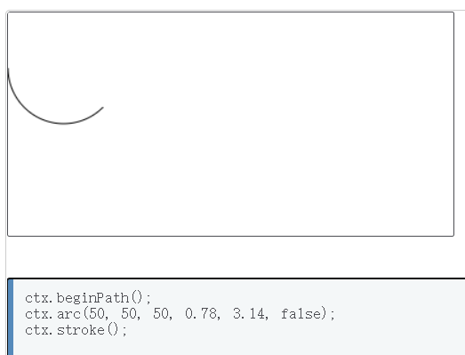

### 6.28

搭建网页基本结构：canvas、文本框、按钮

使用flex布局

为按钮绑定点击事件

坐标跟随

### 6.29

封装圆弧绘制函数

读取文本框中的代码

根据文本框中的代码进行绘图

### 6.30

每次绘制时清空上次的图、文本框下面的参数

如果代码里没有M S F 就不显示h4：导入代码按钮同时清除h4

放大、坐标也放大

### 7.1

- 延时，实现动态绘制直线
  目前思路参考收藏夹最下面2个
  然后自己再试试forEach 里面用setTimeout 是否遵循事件循环

被 **setInterval() 函数要用箭头函数才能传址** 和 **其他函数（比如switch、for）传址只能用复杂数据类型**坑了。

最后**换成数组去传**，配合setInterval() 终于是TM的能实现动画效果了

### 7.2

- 但是只能走45°，明天把判断条件改成 tan 值试试看

改成用tan 来实现，确实能实现不同角度的直线动画了。（详细看第2张草稿，**注意看是> 还是>=** ，一旦出错就会导致走不了X轴或Y轴）

而且今天删减了多余代码（比如 btnDraw 里面就直接使用函数内容了，因为这和封装然后直接用，是同样效果）

### 7.3

- 但是老问题没解决，就是setInterval() 异步执行，导致上一条直线还没画完，下一条就已经开始画了。

我想到的解决方法：

1. 看一下 setInterval 能不能结合 promise/await 
2. 把setInterval 改成for循环 ❎ for循环还是太快了，看不见绘制动画
3. 全部代码都包裹在 setInterval 里面 ❎ 

原本想着干脆把执行每一行for循环拆成一步一步然后到时候自己按按钮

后面发现其实只要把for循环单次封装成一个函数，然后setInterval 里面不断调用它，停止条件就把要用到的参数设在最外层用复杂数据类型传址

在后面发现setInterval 套 setInterval 延时有坑，把外部的setInterval 换成 setTimeout （内部的换不换都无所谓；我换了试了试，并没有区别，所以只换了外层。）https://segmentfault.com/a/1190000040397253

4. 用生成器函数

5. 谷歌一下，同步代码怎么实现延时
6. 去网易群问问题
7. 把按钮改成“逐行执行”
8. 直接瞬间完成，不干了，然后那个机床参数最后M05不识别（给他删了）
9. Promise 经常被用在什么地方？？？

### 7.4

斜线打印bug（拆成8种情况并理清atan2的象限图后解决）

// 记住每次展示要刷新，不然延时会出问题【已解决】

### 7.5

圆弧绘制动画

开始绘制时停用输入框、按钮

### 7.6

写报告

 // 计算圆弧的起始弧度，因为JavaScript的圆弧绘制函数是以x轴方向开始计算，且y轴向下为正，所以用负号

 let startAngle = Math.atan2(-y2 - y, x2  - x)

 // 计算圆弧的终点弧度

 let endAngle = Math.atan2(j, -i)

### 答辩

到时候就展示导入3种不同的代码：

矩形、圆弧、手动从txt输入凸代码

## 重点

### 1 setInterval()的2个注意点

#### 1.1  若想处理外部的变量，一定要【使用不带形参的匿名函数/箭头函数】

##### 错误做法：

如果像下面这样把传入 setInterval()  的函数 flag 写在外面，

那么传入外部变量n的时候，相当于**只是传了一下当前n的值，并没有把n的地址传进去！！！**

~~~js
var timer = null;
let n = 10;
timer = setInterval(flag, 200, n);

function flag(x) {
    x -= 1;
    console.log(x); // 一直打印9
    console.log(n); // 一直打印10
    if (x == 0) clearInterval(timer);
}
~~~

##### 问题原因

因为 setTimeout 中函数内的 **this 是指向了window对象**

这是由于 setTimeout() 调用的代码**运行在与当前函数完全分离的执行环境上**。

这会导致 setTimeout() 中包含的 `this` 关键字会指向 `window` (或`全局`)对象。详细可参考[MDN setTimeout](https://developer.mozilla.org/zh-CN/docs/Web/API/Window/setTimeout)

##### 正确做法：（注意，箭头函数/匿名函数不能写任何形参！！！）：

~~~js
法1 箭头函数：
var timer = null;
let n = 10;
timer = setInterval(
    () => {	// 注意！这里不能写任何形参！！！
        n -= 1;
        console.log(n);
        if (n == 0) clearInterval(timer);
    },
    200,
    n // 这里已经把n传进去了
);
------------------------------------------------------------------------------------
法2 匿名函数：
var timer = null;
let n = 10;
timer = setInterval(
    function () {	// 注意！这里不能写任何形参！！！
        n -= 1;
        console.log(n);
        if (n == 0) clearInterval(timer);
    },
    200,
    n // 这里已经把n传进去了
);
~~~

如果你写了形参，那还是会出错（一直打印9）

~~~js
var timer = null;
let n = 10;
timer = setInterval(
    (x) => {
        x -= 1;
        console.log(x); // 一直打印9
        if (x == 0) clearInterval(timer);
    },
    200,
    n
);
------------------------------------------------------------------------------------
var timer = null;
let n = 10;
timer = setInterval(
    function (x) {	
        x -= 1;
        console.log(x); // 一直打印9
        if (x == 0) clearInterval(timer);
    },
    200,
    n
);
~~~

#### 1.2  大部分情况下，不需要传参，你可以把它看成是上下文的一部分

~~~js
function flagDraw() {
    ......
}
    
function drawLineFlash(canvasContext, x1, y1, x2, y2) {
    let X1 = [x1 * 5];
    let Y1 = [y1 * 5];
    let X2 = [x2 * 5];
    let Y2 = [y2 * 5];
    let tanFlag = Math.atan2((Y2[0] - Y1[0]) / (X2[0] - X1[0]));

    console.log(X1, Y1, X2, Y2); // 50 100 150 150

    var timer = null;
    timer = setInterval(
      () => {
        if (X2[0] == X1[0] && Y2[0] == Y1[0]) {
          clearInterval(timer);
        } else {
          flagDraw(canvasContext, X1, Y1, X2, Y2, tanFlag);// 直接用外部函数！
        }
      },
      200,
      canvasContext, // 传进来的变量,不用传！
      X1, // 传进来再定义的变量,不用传！
      Y1,
      X2,
      Y2,
      tanFlag
    );
}
~~~

上面的 setInterval 即使不传参进去，它也可以拿到外面的变量，相当于是外部上下文的一部分

当然，前提是传入setInterval 的函数**是个不带参数的箭头函数**

~~~js
timer = setInterval(() => {
    if (X2[0] == X1[0] && Y2[0] == Y1[0]) {
        // 如果已经到达终点，停止setInterval()循环
        clearInterval(timer);
    } else {
        flagDraw(canvasContext, X1, Y1, X2, Y2, tanFlag);
    }
}, 20);
~~~

### 2 基本数据类型无法实现传递地址，传递地址你就把一开始设的变量故意设置成数组

如果已经用数组代替简单数据类型了，

记得把原本传值实现不了效果，才在每一段代码后面自己再 ++  -- 的代码删掉，不然每次就会 ++ -- 2次

### 3 使用Math.atan2(Y, X)时

- 记得**前面加Math.**
- 参数是**先Y后X** ！！！不要记成和数学一样以为前面是x后面是y
- **记住中间填的是逗号 , 不是除号 /** 

#### atan2(Y, X)的象限问题：

因为 `180度X负半轴` 即`atan2(0, -1)` 在JS里是`+3.14`，所以第三象限直接从+3.14逆时针到-3.13...

所以如果你要整合在一起，正确做法应该是：

第一象限+上；第二象限+左；第三象限+下；第四象限+右【当然如果还是有一些隐性bug，建议拆成8种情况】

### 4 `.arc()`

如果你在使用圆弧绘制函数时配合使用了`atan2(Y, X)`，那要注意，**因为js默认Y轴为下**，所以应该是：

**上下正负颠倒，X轴左右不变（左边依旧是+3.14）**

~~~js
// 圆弧绘制动画
function drawArcFlash(canvasContext, x1, y1, x2, y2, i, j, anticlockwise) {
  // 计算圆心坐标
  let x = (x1 + i) * 5
  let y = (y1 + j) * 5
  x2 *= 5
  y2 *= 5
  // 计算圆弧半径
  let r = Math.sqrt(Math.pow(i * 5, 2) + Math.pow(j * 5, 2))
  // 计算圆弧的起始弧度
  let startAngle = [Math.atan2(j, -i)]
  // 计算圆弧的终点弧度
  let endAngle = [Math.atan2(y - y2, x2 - x)]
  // 因为JavaScript 的X轴负半轴为+3.14，为了保证逆时针在每个象限都是越来越小，顺时针是越来越大。所以要警惕以下2种特殊情况
  if (startAngle[0] == Math.atan2(0, -10) && endAngle[0] < 0) {
    startAngle[0] = -startAngle[0]
  }

  if (startAngle[0] < 0 && endAngle[0] == Math.atan2(0, -10)) {
    endAngle[0] = -endAngle[0]
  }

  let timer = null
  timer = setInterval(() => {
    console.log('setInterval')
    arcDraw(canvasContext, x, y, r, startAngle, anticlockwise)
    // 因为顺时针的终点弧度比起点弧度大，所以当起点弧度自增到超过终点弧度，就代表该弧线已经画完
    if (anticlockwise == false && startAngle[0] > endAngle[0]) {
      clearInterval(timer)
    }
    // 因为逆时针的终点弧度比起点弧度小，所以当起点弧度自减到小于终点弧度，就代表该弧线已经画完
    if (anticlockwise == true && startAngle[0] < endAngle[0]) {
      clearInterval(timer)
    }
  }, 1)
~~~

示例：

